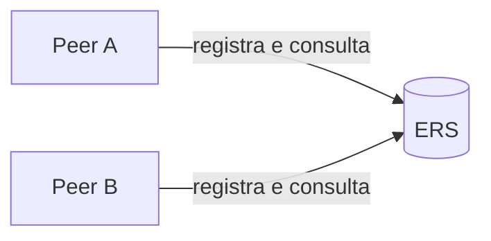
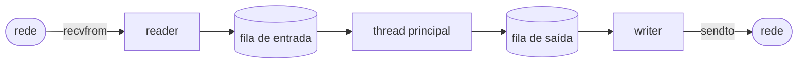
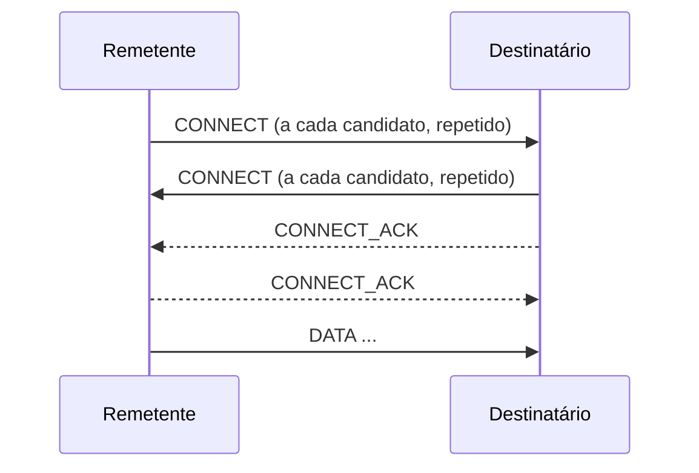
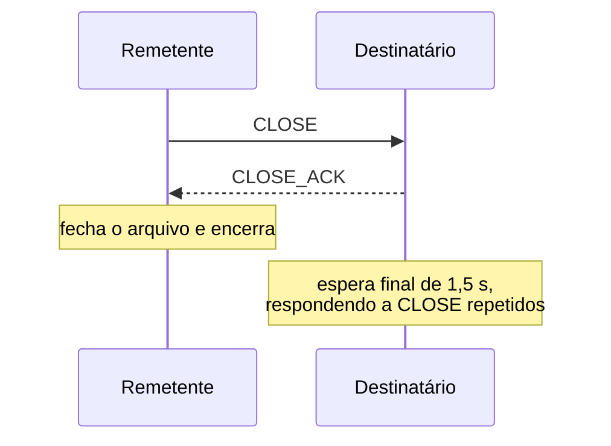
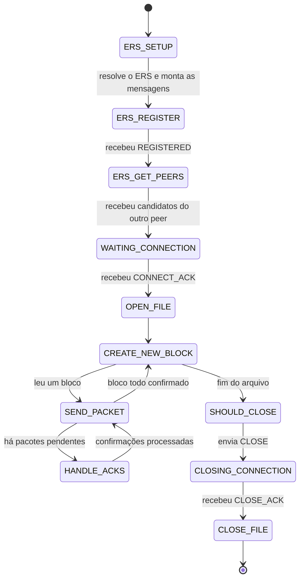
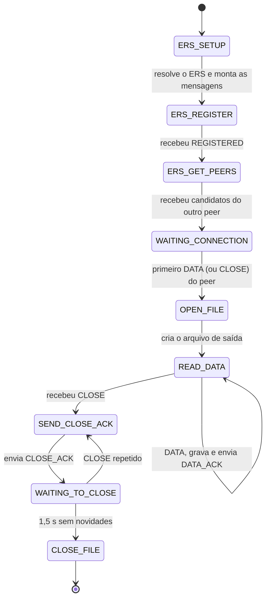
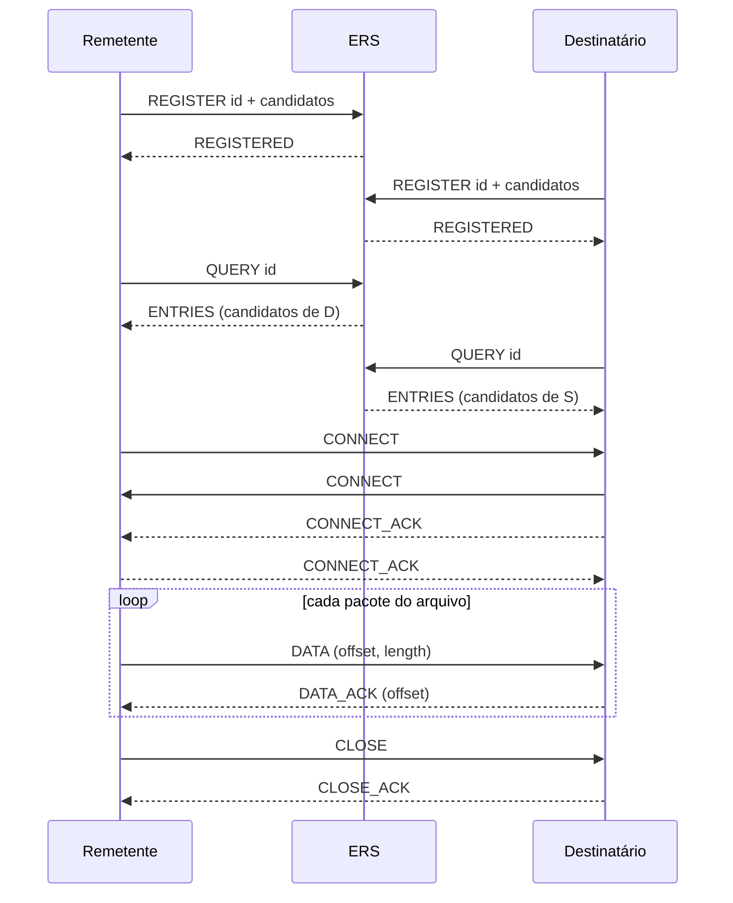

# Documentação — file2peer

Este documento descreve como o `file2peer` funciona: arquitetura, descoberta de peers, formato dos pacotes, handshake, transferência, encerramento e máquinas de estado. Para compilar e usar, veja o [`README.md`](README.md).

## 1. Visão geral

O `file2peer` transfere um arquivo entre dois processos usando **UDP**. Como o UDP não oferece conexão, entrega garantida nem ordenação, o programa implementa por conta própria:

1. **Descoberta**: cada lado descobre o endereço do outro (STUN + ERS).
2. **Conexão**: *handshake* com `CONNECT` / `CONNECT_ACK`, que também abre o caminho pelo NAT (*hole punching*).
3. **Transferência confiável**: pacotes de dados identificados por *offset*, confirmados um a um e retransmitidos quando necessário.
4. **Encerramento**: `CLOSE` / `CLOSE_ACK`, com uma espera final no receptor.

A comunicação acontece em duas fases. Primeiro, os dois peers se encontram por meio de um servidor:



Depois, com os endereços em mãos, passam a conversar **diretamente**, sem servidor no meio:


## 2. Arquitetura de threads

Cada processo tem **um único socket UDP** (importante para o NAT, veja a seção 4) e três threads:

| Thread | Responsabilidade |
|--------|------------------|
| **principal** | contém toda a lógica e o estado do protocolo (máquina de estados) e nunca bloqueia em rede |
| **reader** | fica em `recvfrom()` e coloca cada datagrama recebido na fila de entrada |
| **writer** | retira pacotes da fila de saída e os envia com `sendto()` |

O caminho dos dados é uma linha única:



### Filas (ring buffers)

Cada fila é um buffer circular com **um produtor e um consumidor**, o que dispensa mutex:

- `head` (escrito só pelo produtor) e `tail` (escrito só pelo consumidor) são `_Atomic int` (C11);
- um **semáforo POSIX** acompanha cada fila:
  - na fila de **saída** ele conta os pacotes prontos, e o writer dorme em `sem_wait` enquanto a fila está vazia;
  - na fila de **entrada** ele conta os espaços livres, e o reader dorme quando a fila está cheia;
- cada posição guarda o pacote e o **endereço do remetente/destinatário**, o que permite à lógica principal saber de quem veio cada datagrama.

Como a thread principal só usa operações não bloqueantes sobre as filas, ela consegue cuidar de temporizadores e retransmissões no mesmo laço.

### Tratamento de falhas nas threads de rede

Erros passageiros de rede (por exemplo `EINTR`, `ENOBUFS`, `EHOSTUNREACH`) são ignorados: o pacote é descartado e a retransmissão do protocolo o recupera. Um erro fatal em `sendto`, `recvfrom` ou `sem_wait` faz a thread registrar o `errno` na sua fila e terminar. A thread principal confere esse registro a cada passada do laço, e, se houver falha, encerra a transferência com erro e libera os recursos.

## 3. Descoberta de peers

### 3.1 STUN

**STUN** (*Session Traversal Utilities for NAT*, RFC 5389) é um protocolo existente que permite a um host descobrir o endereço IP e a porta públicos que o NAT lhe atribuiu. O programa envia um *Binding Request* ao servidor STUN **pelo mesmo socket** que usará depois, e lê o atributo `XOR-MAPPED-ADDRESS` da resposta. A construção e a interpretação das mensagens foram implementadas manualmente (cabeçalho de 20 bytes, atributos TLV, XOR com o *magic cookie*). Por padrão é usado o servidor público do Google. O pedido é reenviado a cada 0,5 s e, se não houver resposta em 2 s, o programa segue apenas com os endereços locais.

### 3.2 ERS (Endpoint Rendezvous Server)

Aplicações peer to peer precisam de um servidor para fazer **sinalização e encontro** (*signaling* e *rendezvous*): dois computadores atrás de NATs não têm como saber o endereço um do outro sozinhos. O **ERS** é o servidor desenvolvido para este trabalho com esse papel. Ele é genérico, e funcionaria para outros usos além deste: guarda, para cada ID, uma lista de textos (aqui, endereços), e os devolve a quem perguntar. Ele **não** carrega dados da transferência.

O protocolo do ERS é textual, e cada mensagem é um datagrama UDP, com uma informação por linha.

Registrar endereços:

```
REGISTER <id>
<ip:porta>
<ip:porta>
```

Resposta:

```
REGISTERED <id>
```

Consultar:

```
QUERY <id>
```

Resposta:

```
ENTRIES <id>
<ip:porta>
<ip:porta>
```

Se o pedido for inválido (ID inválido, comando inexistente, texto longo demais para ser registrado), o ERS responde com uma mensagem de erro, que o cliente trata como falha:

```
ERROR
<motivo>
```

### 3.3 Candidatos e fluxo

Cada peer registra até três **candidatos de endereço** para si:

| Candidato | Para quê serve |
|-----------|----------------|
| público (STUN) | peers em redes diferentes |
| LAN | peers na mesma rede local |
| loopback | dois processos na mesma máquina |

O fluxo de cada peer é:

1. Envia `REGISTER` com seus candidatos até receber `REGISTERED`.
2. Envia `QUERY` periodicamente até a resposta conter candidatos que não são seus.
3. Tenta o handshake com todos os candidatos do outro lado.

O **ID de sessão** é gerado pelo remetente e digitado pelo destinatário: é ele que faz os dois se encontrarem no ERS.

## 4. Hole punching

Um NAT só deixa entrar pacotes de um endereço externo se alguém de dentro já enviou algo para ele. Por isso:

- os dois peers enviam `CONNECT` um ao outro **ao mesmo tempo** e repetidamente; cada envio cria (ou renova) a regra de entrada no NAT de quem enviou;
- assim, o `CONNECT` do outro lado já encontra o caminho aberto;
- o socket é **o mesmo** usado no STUN, pois o NAT mapeia a porta local daquele socket.

Como vários candidatos são tentados em paralelo, o primeiro que responder vence.

## 5. Formato dos pacotes

Todo pacote do protocolo começa com um cabeçalho fixo de **12 bytes**:

```
 0        1        2                 4                   8                  12
 ┌────────┬────────┬─────────────────┬───────────────────┬───────────────────┐
 │  type  │reserved│    checksum     │      offset       │      length       │
 │ 1 byte │ 1 byte │     2 bytes     │      4 bytes      │      4 bytes      │
 └────────┴────────┴─────────────────┴───────────────────┴───────────────────┘
```

Nos pacotes de dados (`DATA` e `DATA_ACK`), `offset` e `length` indicam a posição e a quantidade de bytes do arquivo. Nos pacotes de controle eles não são usados.

O payload máximo é **496 bytes** (508 − 12). O valor 508 vem do MTU mínimo do IPv4 (576) menos 60 bytes do cabeçalho IP e 8 do UDP, o que evita fragmentação em qualquer caminho.

| Tipo | Enviado por | Significado |
|------|-------------|-------------|
| `CONNECT` | ambos | pedido de conexão; também abre o NAT |
| `CONNECT_ACK` | ambos | resposta a um `CONNECT`; confirma que o caminho funciona |
| `DATA` | remetente | `length` bytes do arquivo a partir de `offset` |
| `DATA_ACK` | destinatário | confirma o `DATA` com aquele `offset` |
| `CLOSE` | remetente | todo o arquivo foi entregue; pede encerramento |
| `CLOSE_ACK` | destinatário | confirma o `CLOSE` |

Pacotes menores que o cabeçalho, ou `DATA` com `length` maior do que foi recebido, são descartados como inválidos.

## 6. Handshake

O handshake é **simétrico**: ambos enviam `CONNECT` e ambos respondem `CONNECT_ACK`.



- O **remetente** considera a conexão estabelecida ao receber o primeiro `CONNECT_ACK` e passa a usar só aquele endereço.
- O **destinatário** fixa o peer quando chega o primeiro `DATA`. Assim, mesmo que um `CONNECT_ACK` se perca, o primeiro dado já prova que a conexão existe. No caso de um arquivo vazio não há `DATA`, e o primeiro `CLOSE` cumpre esse papel.
- Pacotes de endereços que não estão entre os candidatos conhecidos são ignorados.

## 7. Transferência de dados

O arquivo é lido em **blocos** de `496 × 1024` bytes (≈ 496 KiB), e cada bloco é dividido em até 1024 pacotes. Para cada pacote, o remetente guarda o *offset*, o tamanho, o instante do último envio e se já foi confirmado.

Ciclo de cada bloco:

1. Envia, em pequenos lotes, os pacotes nunca enviados ou cujo último envio passou de 0,5 s.
2. Lê as confirmações que chegaram e marca os pacotes correspondentes (pelo *offset* absoluto no arquivo).
3. Quando todo o bloco está confirmado, lê o próximo.
4. Quando o arquivo termina, inicia o encerramento.

O destinatário, para cada `DATA`, grava os bytes na posição `offset` do arquivo e responde `DATA_ACK`. Como o *offset* é absoluto, **a ordem de chegada não importa** e **duplicatas são inofensivas**: reescrever os mesmos bytes no mesmo lugar não muda nada, e o ACK reenviado corrige a perda de um ACK anterior.

| Problema do UDP | Como é tratado |
|-----------------|----------------|
| perda de `DATA` | o remetente não recebe o ACK e retransmite |
| perda de `DATA_ACK` | o remetente retransmite; o destinatário grava e confirma de novo |
| reordenação ou duplicação | gravação por *offset* absoluto |

Se o arquivo for vazio, nenhum `DATA` é enviado: o remetente passa direto ao encerramento e o destinatário cria um arquivo vazio.

## 8. Encerramento

Nenhum protocolo consegue garantir que os dois lados saibam que o outro terminou (o problema dos Dois Generais). A solução adotada segue a ideia do `TIME_WAIT` do TCP: **quem envia o último ACK espera um tempo para reenviá-lo, se precisar**.



- O remetente reenvia `CLOSE` a cada 0,5 s até receber `CLOSE_ACK`.
- O destinatário responde `CLOSE_ACK` e permanece 1,5 s (3 vezes o intervalo de retransmissão) respondendo a eventuais `CLOSE` repetidos. Isso cobre a perda do `CLOSE_ACK`: o `CLOSE` retransmitido ainda encontra quem responda.
- Ao chegar ao `CLOSE`, todos os dados já foram confirmados, então ele é apenas o aviso final.

Por fim, o programa principal encerra as threads de rede: cancela o reader (que fica bloqueado em `recvfrom`) e pede ao writer que termine depois de esvaziar a fila, o que garante que o último `CLOSE_ACK` seja enviado. Depois faz `pthread_join` de ambas, libera filas e semáforos e fecha o socket.

## 9. Máquinas de estado

Toda a lógica roda em um laço `while (state != EXIT) { switch (state) ... }` na thread principal. Cada passada trata **um** estado sem bloquear, e o tempo é lido uma vez por iteração para decidir retransmissões. Assim, eventos de rede e temporizadores são tratados no mesmo lugar, sem uma thread por conexão.

Qualquer falha fatal (erro de arquivo, resposta de erro do ERS, falha em uma thread de rede) interrompe o laço, libera os recursos e faz o programa terminar com código de saída diferente de zero. Antes de iniciar a rede, o remetente já confere se o arquivo pode ser lido, para não registrar no ERS e esperar o outro lado à toa. As verificações de falha estão resumidas no [`README.md`](README.md#verificação-de-falhas).

### 9.1 Remetente (`send`)



### 9.2 Destinatário (`receive`)



## 10. Sequência completa



## 11. Conceitos demonstrados

- Sockets **UDP** (`socket`, `bind`, `sendto`, `recvfrom`, `getsockname`, `getaddrinfo`).
- **Confiabilidade sobre UDP**: confirmações, retransmissão por timeout, *offsets* absolutos e tratamento de perda, duplicação e reordenação.
- **Encerramento** de conexão sem canal confiável (`CLOSE` / `CLOSE_ACK` e espera final).
- **NAT traversal**: STUN, candidatos de endereço, servidor de encontro e *hole punching* simétrico.
- **Concorrência**: threads POSIX, atomics C11 com ordem de memória, buffers circulares sem trava e semáforos.
- **Máquinas de estado** não bloqueantes para protocolos orientados a eventos.
- Implementação manual de um protocolo binário (STUN) e de um protocolo textual próprio (ERS).

## 12. Escopo

O projeto é uma prova de conceito que cobre o caminho completo de uma transferência peer to peer: descoberta, conexão através de NAT, transferência confiável e encerramento. Para manter o foco nesses conceitos, algumas escolhas são simples:

- uma transferência de um arquivo (de até 4 GiB, pois os *offsets* têm 32 bits) entre dois peers por execução, em IPv4;
- intervalo de retransmissão fixo (0,5 s), com envio em pequenos lotes;
- o ID de sessão é apenas um identificador de encontro, sem autenticação ou criptografia;
- a conexão por *hole punching* funciona com NATs do tipo *cone*; em NAT simétrico ou redes que bloqueiam UDP, seria necessário um relay.

## 13. Evoluções futuras

- Timeouts de inatividade e limite de retentativas, com mensagens de erro claras.
- Checksum no cabeçalho dos pacotes e verificação de integridade do arquivo ao final.
- Nome e tamanho do arquivo no `CONNECT`, e um ID de sessão nos pacotes.
- Janela deslizante com estimativa de RTT e *pacing*, no estilo do controle de congestionamento do TCP.
- Substituir as esperas ativas por `poll()`/`epoll` ou esperas com prazo.
- Conversão explícita de ordem de bytes (`htonl`/`ntohl`) no cabeçalho.
- Vários receptores simultâneos e suporte a IPv6.
